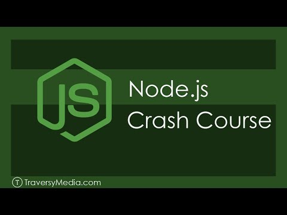

# Study note from Node Crash Course by Brad Traversy

> Code along project was done with the Node crash course.
> [](https://youtu.be/fBNz5xF-Kx4?si=JsAm8scNScgUY3BS)


## Quick Start

```bash
# Install dependencies
npm install

# Serve on localhost:5000
npm start
```
